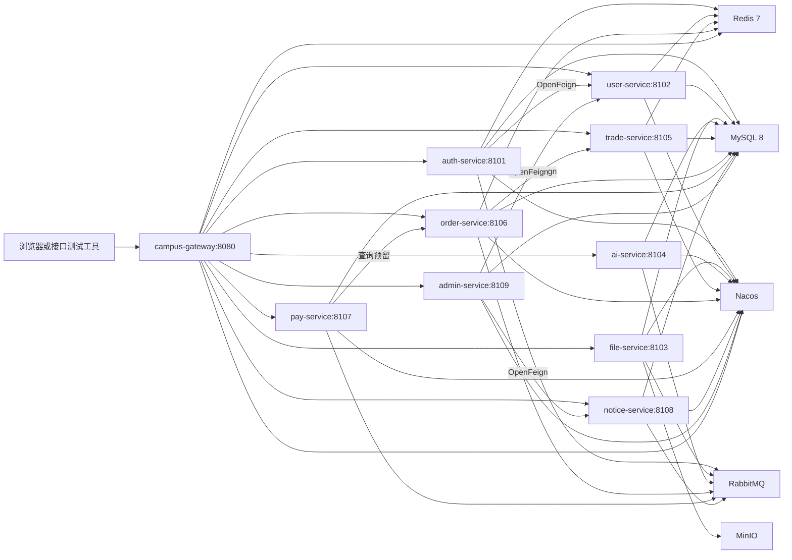
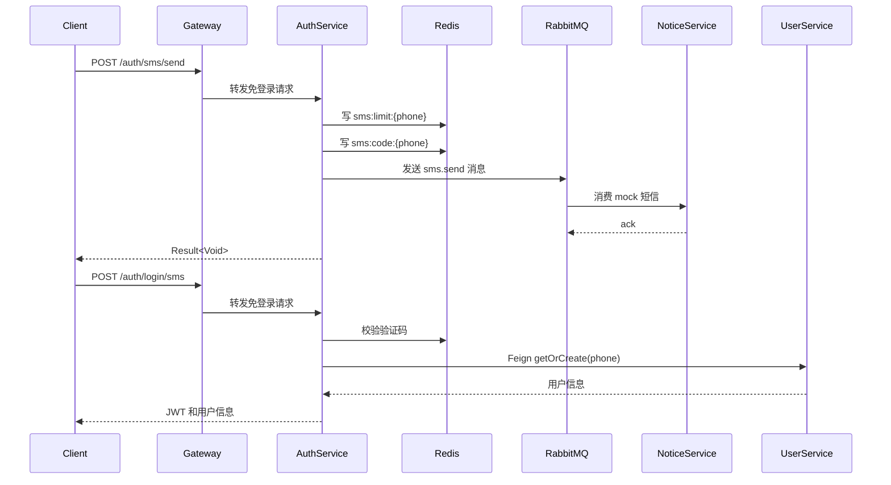
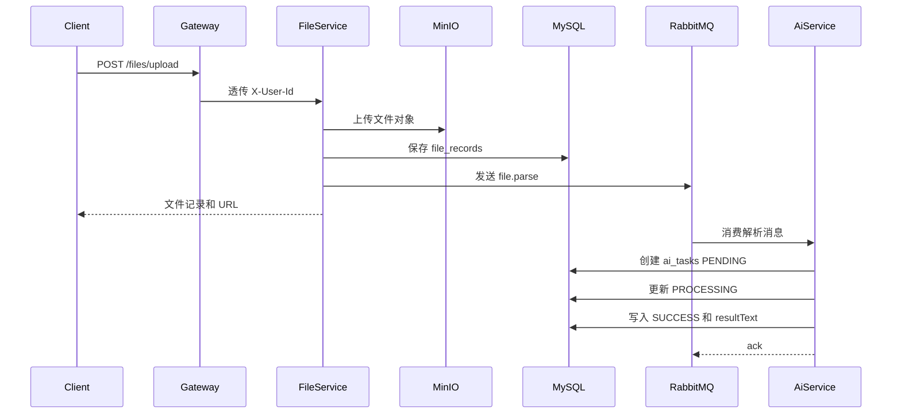
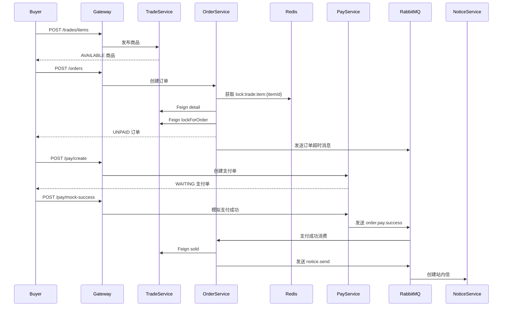

# CampusHub 架构说明

CampusHub 是一个本地微服务实战项目，重点展示 Spring Cloud 微服务拆分、Gateway 统一入口、OpenFeign 服务调用、Redis 缓存和锁、RabbitMQ 异步消息、MinIO 文件存储、Nacos 注册发现等后端能力。

## 系统架构图

## 手机号验证码登录流程图

## 文件上传与 AI 异步解析流程图

## 二手交易下单支付流程图

## 基础组件作用

### Redis

- 保存短信验证码：`sms:code:{phone}`。
- 保存短信发送限流：`sms:limit:{phone}`。
- 缓存用户积分和商品详情。
- 提供分布式锁 key，例如 `lock:trade:item:{itemId}`、`lock:user:points:{userId}`。
- Gateway 使用 Redis 生成按分钟的限流 key。

### RabbitMQ

- `sms.send.queue`：mock 短信通知。
- `ai.parse.queue`：文件上传后异步解析。
- `order.timeout.queue`：订单超时关闭。
- `order.pay.success.queue`：支付成功推动订单状态变化。
- `notice.send.queue`：异步创建站内信。
- `dead.letter.queue`：记录消费失败消息。

### MinIO

- 保存用户上传的文件对象。
- file-service 返回对象 URL，并把文件元数据写入 MySQL。
- 本地启动后需要确保 `campus-files` bucket 存在。

### Nacos

- 作为本地注册中心，服务启动后注册自身实例。
- Gateway 和 OpenFeign 通过服务名访问下游服务。
- 当前配置文件本地也可运行，Nacos 配置导入使用 optional。

### Gateway

- 统一入口，默认端口 `8080`。
- 根据路径路由到各微服务。
- 对 JWT 做初步校验，并把 `X-User-Id`、`X-User-Phone` 传给下游。
- 处理 CORS、白名单和简单限流。

### OpenFeign

- auth-service 调 user-service 完成登录自动注册。
- order-service 调 trade-service 完成商品详情查询、锁定、释放和售出。
- admin-service 调 user-service、notice-service 做后台聚合能力预留。

